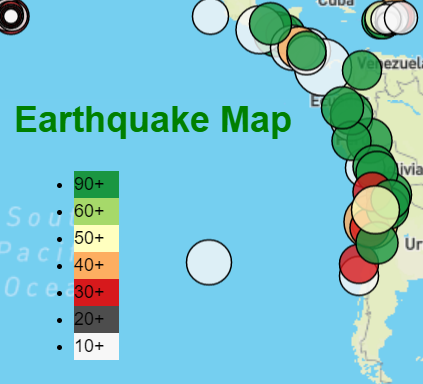

# Leaflet-Challenge

## Background
The United States Geological Survey, or USGS for short, is responsible for providing scientific data about natural hazards, the health of our ecosystems and environment, and the impacts of climate and land-use change. Their scientists develop new methods and tools to supply timely, relevant, and useful information about the Earth and its processes.

The USGS is interested in building a new set of tools that will allow them to visualize their earthquake data. They collect a massive amount of data from all over the world each day, but they lack a meaningful way of displaying it. In this challenge, you have been tasked with developing a way to visualize USGS data that will allow them to better educate the public and other government organizations (and hopefully secure more funding) on issues facing our planet.

## Step by Step Approch

### Step 1: Create the Earthquake Visualization

* URL: `https://earthquake.usgs.gov/earthquakes/feed/v1.0/summary/all_week.geojson`.<br/>

```python
d3.json(queryUrl).then(function (data) {    createFeatures(data.features);});

// Define the createFeatures function to create map layers based on the earthquake data
function createFeatures(earthquakeData) {
  // Use Leaflet to create a GeoJSON layer for the earthquakes
  var earthquakes = L.geoJSON(earthquakeData, {
    // Call the createPopup function to create a popup for each earthquake
    onEachFeature: createPopup,
    // Call the createMarker function to create a marker for each earthquake
    pointToLayer: createMarker,
  });

  // Call the createMap function to create the map and add the earthquake layer to it
  createMap(earthquakes);
}
```
### Step 2: Import and visualize the data by doing the following

Using Leaflet, create a map that plots all the earthquakes from your dataset based on their longitude and latitude.

* Your data markers should reflect the magnitude of the earthquake by their size and the depth of the earthquake by color. Earthquakes with higher magnitudes should appear larger, and earthquakes with greater depth should appear darker in color.


* Include popups that provide additional information about the earthquake when its associated marker is clicked.


* Create a legend that will provide context for your map data.


   

